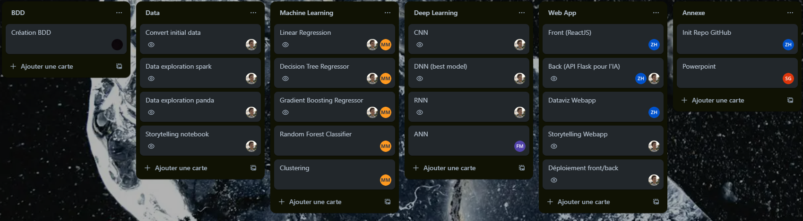

# Hackathon MIA7

## Notebooks

### Deeplearning
Le notebook de Deep Learning est disponible dans le dossier `./deeplearning/` et s'appelle `train_deepl.ipynb`.

Il contient le code pour l'entraînement de 3 modèles de Deep Learning:
- Un RNN simple
- Un CNN
- Un DNN

En ce qui concerne le modèle ANN, le notebook est également situé dans le même dossier et est nommé 'ann.ipynb'.

### Machine Learning
Le notebook de Machine Learning est disponible dans le dossier `./machinelearning/` et s'appelle `train_ml.ipynb`.

Il contient le code pour l'entraînement de 3 modèles de Machine Learning:
- Un modèle de Linear Regression
- Un modèle de Decision Tree Regressor
- Un modèle de Gradient Boosting Regressor

### Spark
Le notebook de Spark est disponible dans le dossier `./volume_spark/spark_data_treatment.py`.

## Web App
### Front-end
Le front-end est disponible dans le dossier `./front-end/`.

### Lancer le front-end

```bash
cd front-end
npm install
npm run start
```

Accéder à l'application sur `http://localhost:3000/`.

### Back-end
L'API Flask est disponible dans le dossier `./back-end/` et s'appelle `main.py`.

### Lancer l'API

```bash
cd back-end
pip install -r requirements.txt
python main.py
```

L'API est accessible sur `http://localhost:8080/`.

### Routes API

- `/games` : Renvoie la liste des jeux olympiques
- `/predict` : Renvoie la prédiction des prochaines médailles gagnées selon les statistiques en input
  - example body :
  ```json
   "sports": 43,
   "epreuves": 234,
   "game_part": 27,
   "prec_game_medal": 113,
   "prec_game_gold": 39,
   "prec_game_silver": 41,
   "prec_game_bronze": 33
  ```
- `/results` : Renvoie la liste des résultats des jeux olympiques avec un système de pagination

## Trello

Il faut la version Premium pour que le Trello soit visible aux observateurs.

Le lien vers le tableau Trello est le suivant : 

